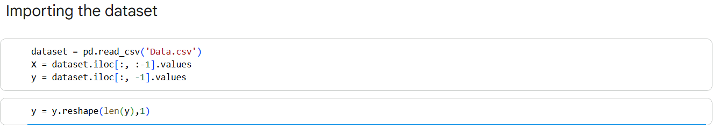
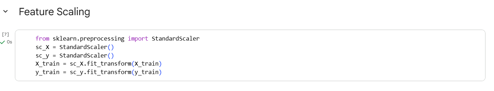
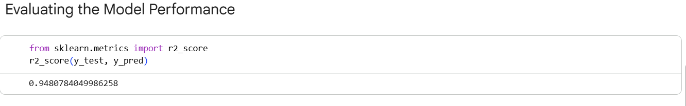
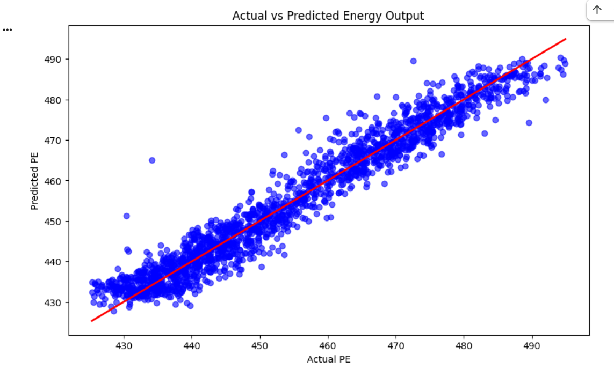

# Support Vector Regression – Power Plant Energy Output Prediction

## 📌 Project Overview

This project demonstrates the implementation of **Support Vector Regression (SVR)** using **Python** and **Scikit-learn** to predict the electrical energy output of a Combined Cycle Power Plant.

The model learns the relationship between environmental conditions and the plant's energy output, enabling accurate power output prediction.

---

## 📊 Dataset

This project uses the **Combined Cycle Power Plant** dataset containing **9,568 observations**.

### Features

| Feature | Description |
|---------|-------------|
| AT | Ambient Temperature |
| V | Exhaust Vacuum |
| AP | Ambient Pressure |
| RH | Relative Humidity |
| PE | Electrical Energy Output (Target Variable) |

Dataset File:

```
Data.csv
```

---

## 🛠️ Technologies Used

- Python
- NumPy
- Pandas
- Matplotlib
- Scikit-learn
- Jupyter Notebook

---

## 🚀 Project Workflow

- Import the required libraries
- Import the dataset
- Split the dataset into training and test sets
- Apply feature scaling
- Train the Support Vector Regression model
- Predict power output
- Evaluate model performance
- Visualize the SVR results

---

## 📈 Model

**Algorithm Used**

- Support Vector Regression (SVR)

**Target Variable**

- PE (Electrical Energy Output)

---

## 📷 Project Screenshots

### 1. Importing the Libraries


---

### 2. Dataset Import



---

### 3. Splitting the Dataset into Training and Test Sets


---

### 4. Feature Scaling



---

### 5. Model Training


---

### 6. Power Output Prediction


---

### 7. Model Evaluation



---

### 8. Support Vector Regression Visualization



---

## 📂 Repository Structure

```
support-vector-regression-power-plant-energy-prediction/
│
├── Data.csv
├── support_vector_regression_power_plant_energy_prediction.ipynb
├── requirements.txt
├── README.md
└── images/
    ├── 01_Importing the Libraries.png
    ├── 02_dataset_import.png
    ├── 03_Splitting the Dataset into Training and Test Sets.png
    ├── 04_feature_scaling.png
    ├── 05_model_training.png
    ├── 06_power_prediction.png
    ├── 07_model_evaluation.png
    └── 08_svr_visualization.png
```

---

## 📌 Future Improvements

- Hyperparameter tuning using GridSearchCV
- Compare SVR with Decision Tree Regression
- Compare SVR with Random Forest Regression
- Improve prediction accuracy through feature engineering
- Experiment with different kernel functions

---

## 📚 Key Learning Outcomes

- Support Vector Regression (SVR)
- Feature Scaling
- Regression Model Training
- Model Prediction
- Model Evaluation
- Data Visualization
- Building End-to-End Machine Learning Projects

---

## 👨‍💻 Author

**Phaneendra G**

GitHub: https://github.com/phaneendrag1

LinkedIn: https://www.linkedin.com/in/phaneendra-g/

---

⭐ If you found this project useful, consider giving it a **Star**!
